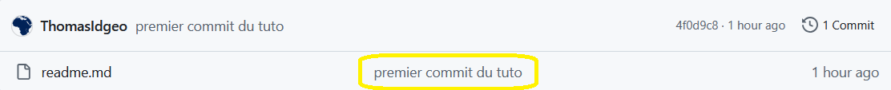

Tuto initiation git
----------------------

### Introduction

**Préalable.** Création d'un repo distant sur la plateforme Github

1 . Création d'un dossier sur le PC => pour le moment un dossier classique

2. On créé le premier fichier readme.md (qui va être la page d'accueil de notre repo)

3. On va initialiser ce dossier classique, comme un repo local avec la commande 

```git init```

Cette commande entraîne la création d'un sous répertoire .git, notre dossier *"classique"* local est devenu un repository au sens git du terme.

4. on va *"stagger"* le fichier readme.md

```git add readme.md```

5. on *"commit"* avec l'option message -m (qui appraîtra dans le repo github)



```git commit -m "first commit"```

6. On renomme la branche principale en *"main"* (car git en local a créer la branche master, mais github attend main par convention)

```git branch -M main```

7. On créé le lien de notre repo local avec le repo distant

```git remote add origin https://github.com/ThomasIdgeo/tuto_git_cpgeom.git```

8. On *"push"* le repo local vers le distant

```git push -u origin main```

**Conclusion**

Notre repo local est jumelé avec le distant. Vu que je viens de compléter ce fichier readme après le premier commit, je me contredis moi même, je dois donc refaire un commit pour être "iso".

- le fichier readme a été modifier, le dossier img a été ajouté
```
Your branch is up to date with 'origin/main'.

Changes not staged for commit:
  (use "git add <file>..." to update what will be committed)
  (use "git restore <file>..." to discard changes in working directory)
        modified:   readme.md

Untracked files:
  (use "git add <file>..." to include in what will be committed)
        img/
```

Il faut donc ajouter ces éléments au stage avec

```git add *```

Puis on *commit*

```git commit -m "complément repo intiialisation"```

puis on *push*

```git push```

### La suite du travail

Nous allons créer des branches.